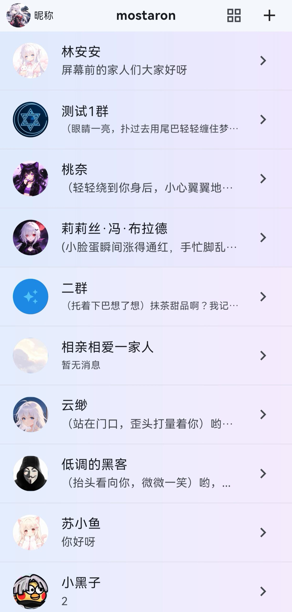

# mostaron

> BYOK · 本地优先 · AI 角色扮演聊天 App（Android / Flutter）

mostaron 是一个面向 Android 的 **AI 角色扮演聊天**应用：你用自己的 API Key 连接任意 OpenAI 兼容接口，创建/编辑角色，与它们进行沉浸式单聊与**群聊**。它把角色卡、世界书、长期记忆、主题与聊天气泡等角色扮演要素都放在本地（SQLite），数据由你掌控。

> 本项目为个人学习/开源分享用途，**代码主体由 AI 生成**，仅供学习参考。

参考 [LettuceAI](https://github.com/LettuceAI/app) 与 [TavernAI](https://github.com/TavernAI/TavernAI) 的开源设计（角色卡 / 世界书 / 记忆 / 提示词模板），本工程为个人重写实现。

---

## 概览

| | |
|---|---|
| 平台 | Android（Flutter） |
| 接口 | 任意 **OpenAI 兼容** API（BYOK，自带 Key） |
| 模型 | 多模型分组，可一键切换（单聊 + 群聊） |
| 存储 | 全本地 **SQLite**，不上传 |
| 形态 | 单文件 APK，安装即用，界面轻量 |

---

## ✨ 功能

### 🎭 角色扮演
- 创建/编辑角色：头像、人设、性格、语气、背景故事、开场白、自定义聊天背景。
- **用文字一键生成角色**。
- 克隆 / 重置 / **置顶**；从长按菜单一键创建群聊。
- 每个角色独立设置（上下文轮数、记忆上限、感应现实等），默认沿用主设置，可随时覆盖。

### 💬 群聊
- 多角色同框聊天，互相可见，成员**拉人/踢人**（删除需确认）。
- 三种回复模式：
  - **全员回复**：每个人各回一条，被@的角色优先。
  - **指定发言**：输入框上方出现成员胶囊，点谁谁回。
  - **自然聊天**：AI 判断是否回复，**轮流**，**至少一人**回复。
- 群聊同样支持：模型切换、长记忆、世界书、自定义头像/背景、隐藏头像。

### ⚡ 轻量与即时
- **流式打字机**输出，逐字生成，动作 `（动作）` 与台词混合渲染（兼容 `*动作*` / `(动作)`）。
- 单文件安装，启动直接进入；对话进入即自动定位到底部，**回车换行**。
- 最新一轮消息下方一键 **重生成 / 删除 / 编辑 / 生成我的回复**。
- 长按复制、触摸展开**思考**、上下文轮数可调。

### 🧠 长期记忆
- 置顶记忆写入 **AGENTS.md** 长期生效；最近记忆自动注入上下文。
- **AI 手动/自动生成记忆**、记忆达上限自动清理、**感应现实**（知道当前日期时间）。

### 📖 世界书（全局 + 按角色/群勾选）
- **全局管理**：在“设置 → 世界书”里新增/编辑/删除条目。
- 每个角色/群聊在编辑里**独立勾选**启用哪些（默认全不启用）。
- 命中关键词的条目作为背景注入，增强沉浸。

### 🎨 个性化与主题
- 自定义身份（名字/性别/关系/身份背景）。
- **聊天气泡颜色与透明度**（预设 + 调色盘，可保存/删除）。
- 多主题色、亮/暗/跟随系统、**夜间自动切暗色**（可设起止时间）、**自定义主题背景**。
- 角色/群聊**独立聊天背景**，与主设置互不影响。

### 🔐 隐私与安全
- **全部数据只存在本地 SQLite**，不联网上传任何内容。
- 联网仅用于调用你**自己配置**的接口；App 本身**不持有服务器**，不收集任何账号/聊天数据。
- 导出/导入为**合并模式**，导入不覆盖已有数据。

---

## 📸 截图

| 主页 | 聊天 | 聊天自定义背景 |
|---|---|---|
|  |  |  |

---

## 🚀 快速开始

### 使用
1. 安装 APK（可在 **Release** 页下载，或自行从源码构建）。
2. 进入 **设置 → 接口**，点 **添加接口**：填名称、**Base URL**、**API Key**、模型名（可用**快速预设**与**获取模型**一键填充）。
3. 回到主页，右上角 **＋** → **添加角色**（或用文字一键生成）。
4. 点角色/群聊卡片开始聊天。

### 从源码构建
```bash
git clone https://github.com/weme1206/mostaron.git
cd mostaron
flutter pub get
flutter build apk --release
```
产物：`build/app/outputs/flutter-apk/app-release.apk`

> 详细操作见 [docs/使用说明.md](docs/使用说明.md)；开发与构建见 [docs/开发与构建.md](docs/开发与构建.md)。

---

## 📁 目录结构
```
lib/
  main.dart                  # 入口
  src/
    models/                  # 数据模型
    data/db.dart             # SQLite 本地库（v7）
    services/                # API 客户端、提示词、设置解析
    state/app_state.dart     # 全局状态
    ui/                      # 界面（聊天/角色/群聊/设置/裁剪等）
    utils/                   # 工具（动作解析、颜色）
android/                     # Android 工程
assets/icon/                 # 应用图标
docs/                        # 文档与截图
```

---

## ⚠️ 声明
- 本项目**主要由 AI 生成**，作者在 AI 辅助的基础上进行整理与测试，代码仅供学习与交流。
- 请仅为合法用途使用；你对自己的 API Key 与生成内容负责。
- 本项目不收集、不上传任何用户数据。

## 📄 许可证
[MIT](LICENSE) © weme1206
